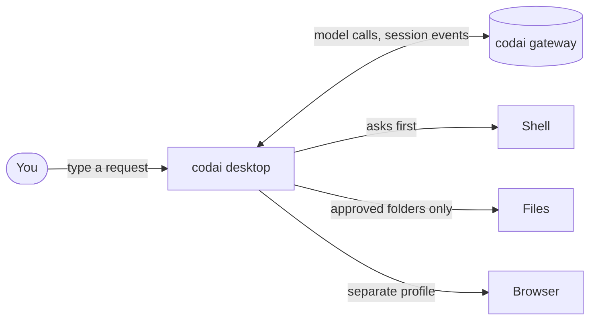
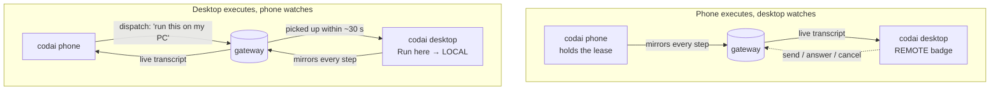

<p align="center">
  
</p>

<h1 align="center">codai desktop</h1>

<p align="center">
  <b>Your AI assistant, sitting at your own computer.</b><br />
  Ask it to do things with your files, your shell and your browser — and watch what it does, from any of your devices.
</p>

<p align="center">
  <a href="LICENSE"></a>
  
  
  <a href="https://github.com/codai-ro/codai-desktop/releases"></a>
</p>

---

codai desktop is a small app for Windows (macOS and Linux are coming) that lets
the [codai](https://codai.ro) assistant work on **your** computer: it can run
commands, read and write files in folders you approve, and drive a browser —
always asking before it does anything that changes something. It also shows
you, live, what codai is doing on your **other** devices, like your phone.

> **Status:** early (v0.1). The Windows installer is built and signed; macOS
> and Linux builds are planned but not published yet. Expect rough edges and
> please [tell us](https://github.com/codai-ro/codai-desktop/issues/new/choose)
> about them.

## What can it do?

- **Do things with your files.**
  Ask: _"Find the biggest files in my Downloads folder and list them."_
- **Run commands for you** (PowerShell on Windows, bash elsewhere) — it asks first.
  Ask: _"Check which version of Node I have installed and whether pnpm is on my path."_
- **Use a browser on your behalf**, in a separate, clean browser profile.
  Ask: _"Open the Tauri prerequisites page and tell me what I need to install on Windows."_
- **Answer its questions.** When codai is unsure, it shows a card with options —
  pick one, or type a reply.
- **Watch and steer sessions running elsewhere.** If codai is doing something on
  your phone, the desktop shows the live transcript with a **REMOTE** badge. You
  can send a message, answer a question or cancel — if you have the right role.
- **Hand work to this computer from anywhere.** From the phone or the web
  console you can _dispatch_ a task to this desktop; it picks it up within
  about 30 seconds and runs it here.
- **See what it costs.** Every session has a cost card broken down by model.
- **Manage your devices** — see which devices are signed in and revoke one.

## How it works

Two moving parts: the codai **gateway** (in the cloud, or self-hosted) does the
thinking; codai **desktop** does the doing, on your machine.



Because sessions are **shared**, more than one device can look at the same
conversation. Exactly one device _executes_ at a time (it holds the
**lease**); the others watch.



The protocol between devices and the gateway is public and documented in
[codai-protocol](https://github.com/codai-ro/codai-protocol).

## Privacy & safety

- **Approved folders only.** File tools can only see the folders you list in
  _Settings → Executor_ (by default just your home folder). Paths are
  canonicalised, so tricks like `..` or symlinks pointing outside are refused.
- **It asks before acting.** Running a command, writing a file or doing
  anything in the browser shows an ask card: **Allow once**, **Always allow
  (this session)** or **Deny**. Reading files and taking a browser snapshot do
  not need approval. Anything that is not a clear "yes" counts as a deny.
- **Limits, not surprises.** Command output is capped at 64 KB per stream and
  every command has a timeout (default 30 s). Whole turns have a time budget
  too (default 10 minutes) so a stuck task ends instead of hanging.
- **A separate browser.** The browser tool launches Edge or Chrome with its
  own profile folder, so it never touches your personal tabs, cookies or
  passwords.
- **What is sent to the gateway.** Your request, the conversation so far, tool
  results (the parts the model needs to see — e.g. the command output or file
  content it asked for) and a mirror of each step so your other devices can
  follow along. Your API key is stored locally and sent only as an
  `Authorization` header to the gateway URL you configured. There is no
  analytics SDK.
- **Signed updates.** The app checks
  `https://codai.ro/api/desktop/latest.json` and installs an update only
  if its signature matches the public key built into the app. See
  [docs/release.md](docs/release.md) to verify a download yourself.
- **Locked-down app shell.** Every native capability the app can use is
  allow-listed one by one (Tauri capabilities); network access is scoped to
  the gateway origin.

Found a security problem? Please read [SECURITY.md](SECURITY.md) — don't open a
public issue.

## Install

### Windows (available now)

1. Download `codai_<version>_x64-setup.exe` from the
   [Releases](https://github.com/codai-ro/codai-desktop/releases) page.
2. Run it. It installs for the current user only (no admin prompt needed).
3. On first launch, paste your `codai_…` API key. You get one from the
   [codai console](https://codai.ro). If you self-host, enter your gateway URL
   too.

Updates arrive automatically through the built-in updater.

### macOS and Linux (coming)

The project is set up to build `.dmg`, `.AppImage` and `.deb` packages, but we
have only produced and tested the Windows build so far. Follow the
[Releases](https://github.com/codai-ro/codai-desktop/releases) page — or build
from source (see [For developers](#for-developers)).

New here? The step-by-step [Getting started](docs/getting-started.md) guide is
written for non-developers. Questions? Try the [FAQ](docs/faq.md).

## Using it

**Two ways to be in a session:**

| Mode                            | When                                        | What you can do                                                                                                       |
| ------------------------------- | ------------------------------------------- | --------------------------------------------------------------------------------------------------------------------- |
| **Watching** (badge **REMOTE**) | Another device holds the lease              | Read the live transcript, see who is present and who is driving, and — as an editor or owner — send, answer or cancel |
| **Run here** (badge **LOCAL**)  | You clicked _Run here_ on a session you own | codai executes on this computer with shell, files and browser; every step is mirrored for your other devices          |

- **Run here** claims the lease. If another device already has it, the panel
  tells you who and offers **Take over**. Clicking **Stop** (or closing the
  window) releases it.
- **Roles:** _owner_ can do everything including Run here; _editor_ can send,
  answer and cancel; _viewer_ can only watch (controls are shown disabled with
  the reason).
- **Sharing:** sessions are shared from the web console, where you invite
  another person or device with a role. Shared sessions appear in the
  desktop under _Sessions → Shared with me_.
- **Dispatch:** from your phone or the console, send a task to this desktop.
  It polls every 30 s and runs it. Turn this off in _Settings → Executor →
  "Run tasks dispatched to this device"_.

**Keyboard**

| Shortcut               | Action                                         |
| ---------------------- | ---------------------------------------------- |
| `Ctrl` / `⌘` + `Enter` | Send a message, or answer the pending question |
| `Esc`                  | Cancel the running turn                        |

Screenshots live in [`docs/img/`](docs/img/README.md) — we are still collecting
them.

## For developers

**Prerequisites**

- Node 22+ and [pnpm](https://pnpm.io)
- Rust stable (1.77.2 or newer) via [rustup](https://rustup.rs)
- The [Tauri 2 prerequisites](https://v2.tauri.app/start/prerequisites/) for
  your OS: WebView2 on Windows (already present on Windows 10/11), Xcode
  Command Line Tools on macOS, `libwebkit2gtk-4.1-dev` and friends on Linux

**Run and build**

```sh
pnpm install
pnpm tauri dev                     # Vite on :5180 + a Tauri window
pnpm tauri build --bundles nsis    # Windows installer → src-tauri/target/release/bundle/nsis
pnpm build                         # frontend only → dist/
```

Other bundles: `dmg` (macOS), `appimage`, `deb` (Linux) — untested so far.

> A release build with the updater public key in `tauri.conf.json` **fails on
> purpose** unless `TAURI_SIGNING_PRIVATE_KEY` is set (see
> [docs/release.md](docs/release.md)). For a local unsigned build, temporarily
> set `bundle.createUpdaterArtifacts` to `false`.

**Checks**

```sh
pnpm typecheck
pnpm lint
pnpm test                          # vitest: permissions, event sink, controls, lease, turn loop, SSE parser
cargo check --manifest-path src-tauri/Cargo.toml
```

**Layout**

| Path                                            | What lives there                                                                                                                    |
| ----------------------------------------------- | ----------------------------------------------------------------------------------------------------------------------------------- |
| `src/app.tsx`, `src/store.ts`                   | App shell, routing, zustand store (settings, sessions, executors)                                                                   |
| `src/features/onboarding`                       | First-run: paste key, optional gateway URL                                                                                          |
| `src/features/sessions`                         | Sessions list (mine + shared), role and REMOTE badges                                                                               |
| `src/features/session`                          | Live transcript (SSE), presence, control bar, cost card, _Run here_ panel                                                           |
| `src/features/devices`, `src/features/settings` | Devices page; gateway URL, device name, executor settings                                                                           |
| `src/executor/`                                 | The agent loop: `agent-run.ts`, `permissions.ts`, `lease.ts`, `event-sink.ts`, `controls.ts`, `executor.ts`                         |
| `src/lib/gateway.ts`                            | Typed client for the shared-sessions protocol (over `@tauri-apps/plugin-http`)                                                      |
| `src-tauri/src/executor/`                       | Rust tools: `shell.rs`, `fs.rs`, `browser.rs` (CDP over loopback WebSocket)                                                         |
| `src-tauri/src/secure_store.rs`, `device.rs`    | API key store; per-install device id                                                                                                |
| `src-tauri/capabilities/default.json`           | The allow-list of everything the webview may call                                                                                   |
| `docs/`                                         | [Getting started](docs/getting-started.md) · [FAQ](docs/faq.md) · [Architecture](docs/architecture.md) · [Release](docs/release.md) |

More detail in [docs/architecture.md](docs/architecture.md).

## Shared sessions

Everything the desktop says to the gateway — sessions, events, leases,
controls, dispatch — is the public shared-sessions protocol, kept in
[codai-ro/codai-protocol](https://github.com/codai-ro/codai-protocol). The
phone app ([codai-ro/codai-phone](https://github.com/codai-ro/codai-phone))
speaks the same protocol, which is why the two can watch each other.

## Roadmap

| Item                                               | Status   |
| -------------------------------------------------- | -------- |
| Windows installer with signed auto-update          | ✅ Built |
| macOS `.dmg` and Linux `.AppImage` / `.deb` builds | Planned  |
| System tray + global shortcut                      | Planned  |
| End-to-end tests with the HIDE protocol            | Planned  |

## Contributing

Issues and pull requests are welcome — see [CONTRIBUTING.md](CONTRIBUTING.md).
We use the Developer Certificate of Origin (`git commit -s`), not a CLA.

## Security

See [SECURITY.md](SECURITY.md). Report privately to **security@codai.ro**.

## License

[Apache-2.0](LICENSE). See also [NOTICE](NOTICE).

"codai" is a trademark of Dragos Catalin Vladulescu. Forks must change
`bundle.identifier` (`ro.codai.desktop`) and `productName`.
