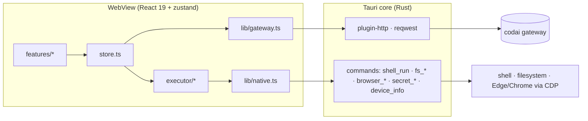

# Architecture

A developer's map of codai desktop. For the wire protocol see
[codai-ro/codai-protocol](https://github.com/codai-ro/codai-protocol).

## Overview

Two layers, one IPC boundary:

- **Frontend** (`src/`): TypeScript, React 19, a single zustand store, Tailwind
  v4. It owns all state, the agent loop and every network call.
- **Native** (`src-tauri/`): Rust. It owns things the webview must not: the
  secret store, the device identity, and the tools that touch the OS.

## Frontend

| Area              | Files                                             | Notes                                                                                                                                                                                                           |
| ----------------- | ------------------------------------------------- | --------------------------------------------------------------------------------------------------------------------------------------------------------------------------------------------------------------- |
| Store             | `src/store.ts`                                    | zustand; settings (persisted via plugin-store), session cache, executor registry, dispatch polling (`startPolling(30_000)` when `autoDispatch`)                                                                 |
| Gateway client    | `src/lib/gateway.ts`, `src/lib/types.ts`          | Typed wrappers over the shared-sessions endpoints; every request carries `Authorization: Bearer`, `x-codai-device`, `x-codai-device-platform: desktop`, `x-codai-device-name`                                   |
| Native bridge     | `src/lib/native.ts`                               | Thin `invoke()` wrappers for the Rust commands                                                                                                                                                                  |
| Onboarding        | `src/features/onboarding/`                        | Key validated with `GET /v1/devices`, then stored via `secret_set`                                                                                                                                              |
| Sessions          | `src/features/sessions/`                          | Mine (`GET /v1/sessions?v=2`) + shared (`/v1/sessions/shared-with-me`); `role-badge.tsx` renders owner/editor/viewer and REMOTE                                                                                 |
| Session           | `src/features/session/`                           | `use-session-stream.ts` (SSE with `after=` resume and backoff), `session-live.tsx` (transcript, presence, control bar, keyboard), `executor-panel.tsx` (Run here / ask cards), `cost-card.tsx`, `event-row.tsx` |
| Devices, Settings | `src/features/devices/`, `src/features/settings/` | Devices list + revoke; gateway URL, device name, executor settings (`fsRoots`, `browserPath`, `budgets`, `model`, `autoDispatch`)                                                                               |

### Why SSE works here

The browser `EventSource` cannot send an `Authorization` header, so all HTTP —
including the event stream — goes through `@tauri-apps/plugin-http`. Its
`fetch` runs in the Rust process (reqwest) and exposes `Response.body` as a
real `ReadableStream` pulled chunk by chunk over IPC, so streaming works on
WebView2 and WebKitGTK without buffering. The CSP is therefore just
`connect-src ipc: http://ipc.localhost`; reachable origins are enforced by the
`http:default` scope in `capabilities/default.json`.

## Executor (`src/executor/`)

A port of the phone app's `AgentRun.kt` / `Agent.kt` loop.

| Module           | Responsibility                                                                                                                                                                                                                                                                                                                                                                |
| ---------------- | ----------------------------------------------------------------------------------------------------------------------------------------------------------------------------------------------------------------------------------------------------------------------------------------------------------------------------------------------------------------------------- |
| `executor.ts`    | One `Executor` per session: owns the lease, the run, the event sink and the control router; exposes start/steer/answer/cancel/stop                                                                                                                                                                                                                                            |
| `agent-run.ts`   | The turn loop: `codai` chat completions (streaming, OpenAI-style tools) over the same gateway and key. Read tools run concurrently, acting tools in order; a failed turn rolls its history back. Emits the trace vocabulary `turn_start`, `step_start`, `req_start`, `tool_call`, `tool_result`, `assistant`, `ask`, `ask_resolved`, `error`, `deadline`, `usage`, `turn_end` |
| `permissions.ts` | Policy + ask broker. Read-only tools (`fs_read`, `fs_list`, `browser_snapshot`) pass; `shell`, `fs_write`, `browser_*` raise an `ask` with `ask_kind: permission` and options _Allow once · Always allow (this session) · Deny_. "Always" is per tool per session; anything not a recognisable yes is a deny; a deny returns `DENIED …` to the model                          |
| `lease.ts`       | State machine: `POST /v1/sessions/:id/lease` (claim, `force: true` for take-over), `PUT` heartbeat every 10 s, `DELETE` on stop / window close. A `409 lease_held` surfaces the holder; a `lease` frame naming another device demotes this one and cancels the turn                                                                                                           |
| `event-sink.ts`  | Mirrors every trace event to `POST /v1/sessions/:id/events`, batched and queued; **fails open** — a gateway hiccup never stops the local run                                                                                                                                                                                                                                  |
| `controls.ts`    | Drains `GET …/controls?applied=false` and live `control` frames: `send` → start turn, `answer` → resolve ask, `approve`/`deny` → permission, `cancel` → abort, `steer`/`inject` → folded into the next step. Marks each with `POST …/control/:cid/applied`; skips controls targeted at another device                                                                         |

### Budgets

Same semantics as the phone's `Deadline.kt`:

| Budget  | Default | Notes                                                      |
| ------- | ------- | ---------------------------------------------------------- |
| Request | 60 s    | One stalled request is retried once                        |
| Tool    | 30 s    | A `shell` call may raise its own `timeout_ms` (max 10 min) |
| Turn    | 10 min  | Time waiting for the user does not count                   |

All three are configurable in Settings → Executor (empty = unlimited). A blown
budget emits `deadline` + `error` and ends the turn.

### Dispatch

There is no push channel to the desktop. On start and every 30 s the store
runs `GET /v1/sessions?v=2` → for each owned session
`GET …/controls?applied=false&target=me` → if anything is queued, claim the
lease (force) and run. Disabled by the `autoDispatch` setting.

## Native (`src-tauri/src/`)

### Tauri commands

Every command is opt-in to the ACL (`build.rs` → `AppManifest::commands`) and
allow-listed individually in `capabilities/default.json`. An unlisted command
is refused by Tauri before it reaches our code.

| Command                                                                                                                           | Capability        | Module                | Behaviour                                                                                                                                                                                  |
| --------------------------------------------------------------------------------------------------------------------------------- | ----------------- | --------------------- | ------------------------------------------------------------------------------------------------------------------------------------------------------------------------------------------ |
| `device_info`                                                                                                                     | `core:default`    | `device.rs`           | Per-install UUID persisted in `device.json`; hostname                                                                                                                                      |
| `secret_get` / `secret_set` / `secret_delete`                                                                                     | `store:default`   | `secure_store.rs`     | API key in `secrets.json` (app data dir)                                                                                                                                                   |
| `shell_run`                                                                                                                       | `allow-shell-run` | `executor/shell.rs`   | `pwsh.exe` (fallback `powershell.exe`) on Windows, `bash -lc` elsewhere. Command ≤ 32 KB; stdout/stderr each capped at 64 KB; timeout kills the whole tree (`taskkill /T` / process group) |
| `fs_read` / `fs_write` / `fs_list` / `fs_roots`                                                                                   | `allow-fs-*`      | `executor/fs.rs`      | Confined to approved roots (default: home). Canonicalised via `dunce`; read ≤ 512 KB (default 64 KB), write ≤ 2 MB, list ≤ 500 entries                                                     |
| `browser_launch` / `browser_detect` / `browser_navigate` / `browser_snapshot` / `browser_click` / `browser_type` / `browser_eval` | `allow-browser-*` | `executor/browser.rs` | Chrome DevTools Protocol, see below                                                                                                                                                        |

Each tool command emits a `tool_progress` event (`{ tool, phase, detail }`)
that drives the activity line in the UI.

### CDP transport

`browser.rs` speaks the Chrome DevTools Protocol over a **blocking
`tungstenite` WebSocket to loopback** — no TLS, no async runtime glue.
`browser_launch` starts Edge or Chrome from the known install paths (or the
`browserPath` setting) with `--remote-debugging-port=9333` and a dedicated
`--user-data-dir` under the app data dir, then waits for `/json/version`.
`browser_snapshot` returns url, title, body text ≤ 20 KB and ≤ 200 interactive
elements as `[tag, text, selector]`.

### Plugins

single-instance (registered first, focuses the existing window), window-state,
updater (endpoint `https://releases.codai.ro/desktop/latest.json`, dialog on),
shell (open only), fs, http, store, notification, dialog, opener, process.

## Where data lives

All under the Tauri app data directory:

| File / dir         | Contents                                                                               |
| ------------------ | -------------------------------------------------------------------------------------- |
| `secrets.json`     | API key (via `secret_*` only)                                                          |
| `device.json`      | Per-install device UUID                                                                |
| `settings.json`    | Gateway URL, device name, `fsRoots`, `browserPath`, `budgets`, `model`, `autoDispatch` |
| `browser-profile/` | The automation browser's profile                                                       |
| window state       | Position/size (tauri-plugin-window-state)                                              |

## Tests

`pnpm test` (vitest, node environment): permission policy and ask broker,
event-sink batching/queue/fail-open, control mapping, the lease state machine
against a mocked gateway, the turn loop against a scripted model, history
trimming, and the chat SSE parser. There are no E2E tests yet (planned; see
README roadmap).
